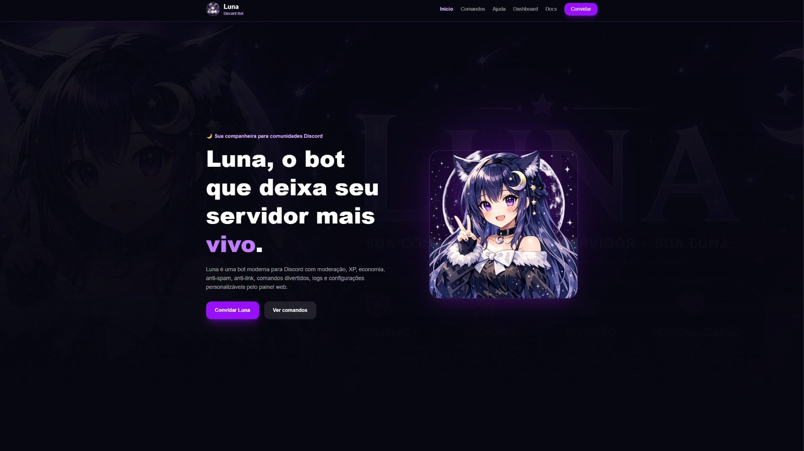
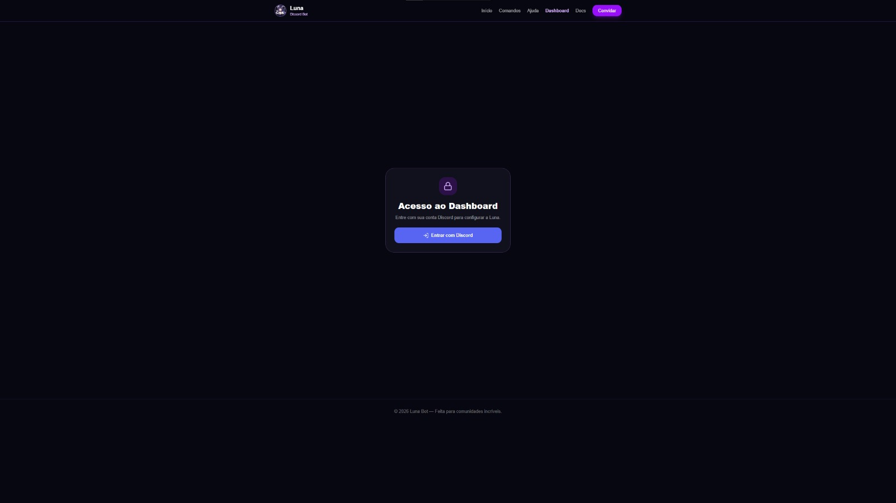
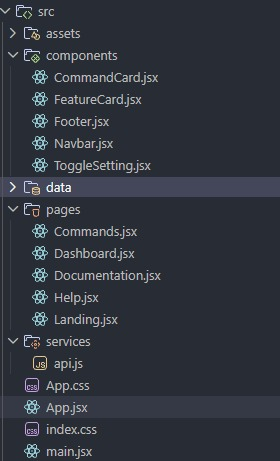
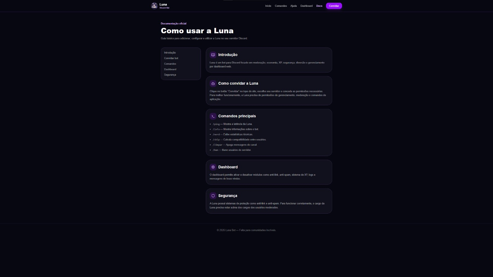
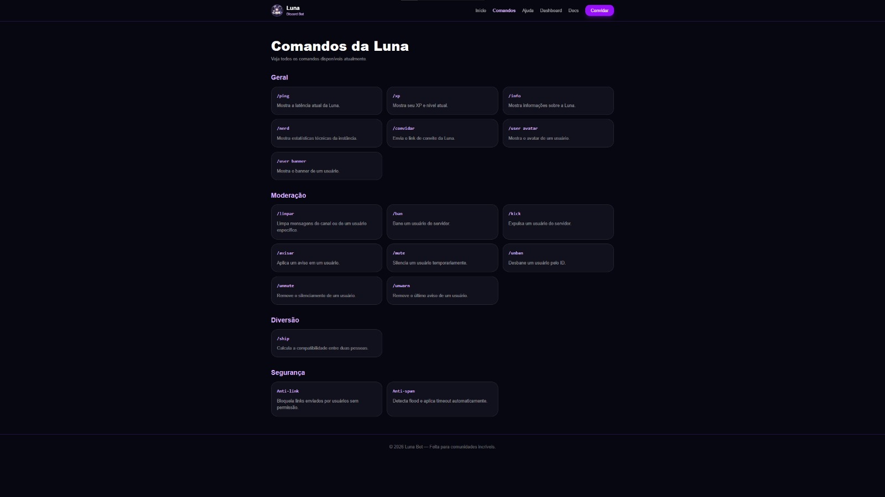
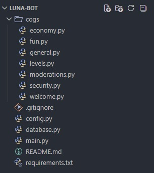

# 🌙 Luna Bot

<div align="center">



### O ecossistema completo para gerenciamento de servidores Discord

**Moderação • Economia • Níveis • Dashboard Web • OAuth2 • Logs • Automação**

Desenvolvido com foco em performance, escalabilidade e experiência do usuário.

</div>

---

# 📖 Sobre o Projeto

A **Luna** é um bot para Discord desenvolvido com o objetivo de fornecer uma solução moderna, intuitiva e completa para administração e personalização de servidores.

O projeto nasceu da necessidade de criar uma plataforma que reunisse recursos essenciais para comunidades Discord em uma única solução, oferecendo desde sistemas de moderação avançados até um dashboard web integrado para gerenciamento remoto.

Diferente de bots tradicionais, a Luna foi projetada como um **ecossistema Full Stack**, composto por múltiplos serviços que trabalham em conjunto para entregar uma experiência moderna e profissional.

---

# ✨ Principais Funcionalidades

## 🛡️ Sistema de Moderação

Ferramentas administrativas para auxiliar moderadores e administradores na gestão do servidor.

### Recursos

* Sistema de banimento
* Sistema de expulsão
* Limpeza de mensagens
* Sistema de avisos
* Sistema de mute
* Logs administrativos
* Anti Link
* Anti Invite
* Anti Spam

---

## 💰 Sistema de Economia

Sistema de economia virtual integrado ao Discord.

### Recursos

* Recompensa diária (`/daily`)
* Perfil econômico
* Armazenamento de moedas
* Evolução de usuários
* Integração com banco de dados

---

## 📈 Sistema de XP e Níveis

Sistema de progressão automática para incentivar a participação dos membros.

### Recursos

* Ganho automático de XP
* Sistema de níveis
* Progressão contínua
* Armazenamento persistente

---

## 🎉 Sistema de Boas-Vindas

Automação para recepção de novos membros.

### Recursos

* Mensagens personalizadas
* Configuração pelo dashboard
* Integração com canais específicos

---

## 📜 Sistema de Logs

Monitoramento de eventos importantes do servidor.

### Recursos

* Entrada de membros
* Saída de membros
* Ações administrativas
* Eventos de moderação

---

## 🌐 Dashboard Web

Painel administrativo desenvolvido para simplificar a configuração do bot.

### Recursos

* Login com Discord
* Seleção de servidores
* Configuração de módulos
* Interface responsiva
* Gerenciamento remoto

---

# 📸 Screenshots

## 🏠 Landing Page


A página inicial apresenta os principais recursos da Luna, informações sobre o projeto e acesso rápido ao dashboard.

---

## 🔑 Sistema de Login



Autenticação segura utilizando Discord OAuth2.

---

## ⚙️ Dashboard



Painel administrativo responsável pelo gerenciamento das funcionalidades do bot.

---

## 📚 Documentação



Área dedicada à documentação dos comandos e funcionalidades.

---

## 🤖 Comandos



Interface contendo os comandos disponíveis na plataforma.

---

## 🏗️ Arquitetura



Visão geral da arquitetura do projeto e comunicação entre os serviços.

---

# 🏗️ Arquitetura do Sistema

A Luna é composta por múltiplas aplicações integradas.

```text
Discord
   │
   ▼
Luna Bot (Discord.py)
   │
   ▼
FastAPI REST API
   │
   ▼
SQLite / PostgreSQL
   ▲
   │
Dashboard React
```

## Componentes

### 🤖 Bot Discord

Responsável por:

* Comandos Slash
* Eventos Discord
* Moderação
* Economia
* Sistema de XP

Tecnologias:

* Python
* Discord.py
* Aiosqlite

---

### ⚡ API Backend

Responsável por:

* Integração Dashboard ↔ Bot
* OAuth2
* Configurações
* Endpoints REST

Tecnologias:

* Python
* FastAPI
* JWT
* Uvicorn

---

### 🎨 Frontend

Responsável por:

* Dashboard
* Configurações
* Interface do usuário

Tecnologias:

* React
* TypeScript
* TailwindCSS
* Vite

---

### 🗄️ Banco de Dados

Responsável por armazenar:

* Usuários
* Economia
* XP
* Configurações
* Logs

Tecnologias:

* SQLite
* PostgreSQL (planejado)

---

# 🛠️ Stack Tecnológica

## Backend

* Python
* FastAPI
* Discord.py
* Aiosqlite

## Frontend

* React
* TypeScript
* TailwindCSS
* Vite

## Banco de Dados

* SQLite
* PostgreSQL

## Infraestrutura

* Railway
* Render
* Cloudflare Pages

## Ferramentas

* Git
* GitHub
* VS Code

---

# 📂 Estrutura Geral

```text
Luna/
│
├── Bot/
│   ├── cogs/
│   ├── database/
│   ├── events/
│   └── commands/
│
├── API/
│   ├── routes/
│   ├── auth/
│   ├── models/
│   └── services/
│
├── Dashboard/
│   ├── src/
│   ├── pages/
│   ├── components/
│   └── assets/
│
└── Database/
```

---

# 🚀 Roadmap

## ✅ Concluído

* Sistema de XP
* Sistema de Economia
* Sistema de Moderação
* Comandos Slash
* Estrutura Backend
* Estrutura Frontend
* OAuth2 Discord

## 🚧 Em Desenvolvimento

* Dashboard Completo
* Sistema de Boas-Vindas
* Logs Avançados
* Configurações por Servidor

## 🎯 Futuro

* Sistema de Tickets
* Sistema de Música
* Sistema de Reações
* Níveis com Recompensas
* Painel Administrativo Avançado
* Sistema Premium
* Integração com IA

---

# 🎯 Objetivos do Projeto

A Luna busca se tornar uma plataforma completa para gerenciamento de comunidades Discord, oferecendo recursos modernos e uma experiência intuitiva para administradores e membros.

O foco principal do projeto é unir:

* Facilidade de uso
* Performance
* Escalabilidade
* Segurança
* Arquitetura moderna

---

# 👨‍💻 Desenvolvedor

## Enzo Pietrantonio

Desenvolvedor Full Stack focado em:

* Python
* React
* APIs REST
* Automação
* Desenvolvimento Web
* Bots para Discord

Atualmente estudando Engenharia de Software e desenvolvendo projetos voltados para aplicações modernas, automação e sistemas escaláveis.

---

# 📄 Licença

Este projeto é disponibilizado para fins de demonstração e portfólio.

Todos os direitos reservados ao autor.

---

<div align="center">

### 🌙 Luna Bot

**Desenvolvido por Enzo Pietrantonio**

*"Transformando servidores Discord em experiências mais inteligentes."*

</div>
